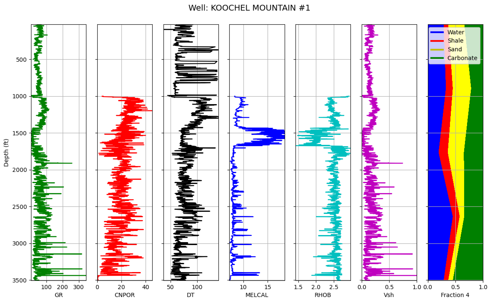

# well_log_tracks
## Experiment with creating various tracks in a well log plot.

2020-September

This script builds on another script by:  
Ryan A. Mardani, linkedin.com/in/amardani  
The reference work is:  
https://towardsdatascience.com/10-steps-in-pandas-to-process-las-file-and-plot-610732093338  
"10 Steps in Pandas to Process LAS File and Plot (Part 1)"

This script adds two extensions to the cited Mardani work:
  1. Two logs in the additional 7th track.
  2. Add a "fraction" track to the previous conventional well log display (below).

## Explanation of polygon track

Each "series" (below left) is the fundamental input, the depth series of a constituent (sand, shale, etc.). Each "fraction" (below center) is computed by adding the previous depth series to the previous constituent. Each "polygon" (below right) is the points of the fraction and the reverse of the points of the previous ("shallower") fraction.  Note that Matplotlib's ContourSet does **not** require the last point to be the same as the first point.

## Confessions

  1. To make my "fraction" plot, I used Matplotlib's "ContourSet."  This might have been easier with Matplotlib's "stackplot" but I could not figure out how to turn a stackplot on its side.
  2. Currently, this work is a product of Python 3.8 in PyCharm.
